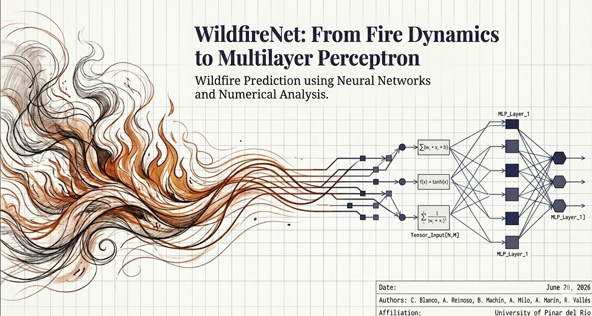
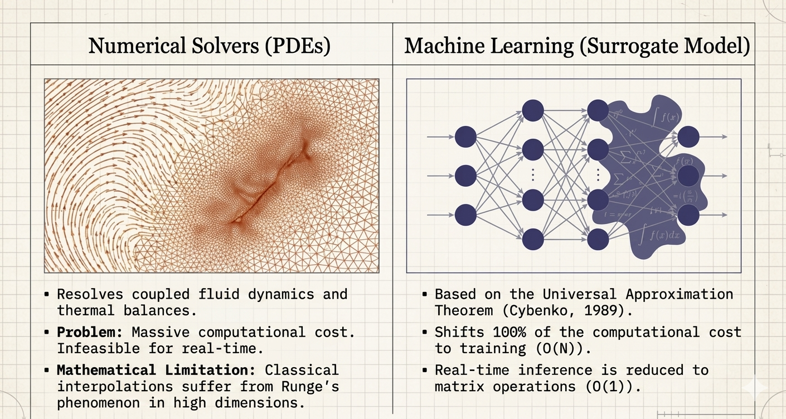
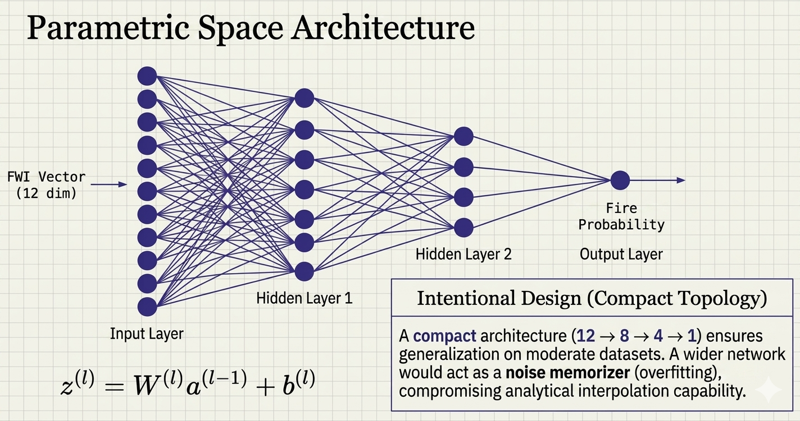
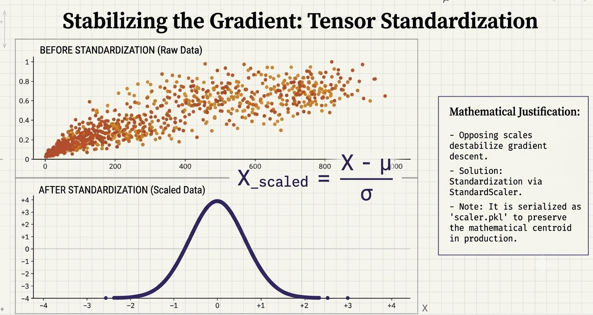

# WildfireNet: Predicting Wildfires with Neural Networks

**Wildfire Risk Prediction using MLPs, PyTorch & FastAPI**

[](https://www.python.org/downloads/)
[](https://fastapi.tiangolo.com)
[](https://pytorch.org)

  
*Project overview: Wildfire prediction using numerical analysis and neural networks.*

---

## 📖 Abstract

This project presents the mathematical foundations of Multilayer Perceptrons (MLPs) and their application to wildfire risk prediction. Leveraging the Universal Approximation Theorem, we implement a compact neural network (12→8→4→1) that acts as a **numerical surrogate model** for complex fire dynamics. The system achieves **92% accuracy** on the Canadian FWI dataset and exposes a REST API for real-time inference. This README walks you through the math, the architecture, and the code.

---

## 🔥 Why Machine Learning? (Numerical Solvers vs. Surrogate Models)

Traditional physics-based models rely on solving coupled Partial Differential Equations (PDEs) (Navier-Stokes, thermal balances). While accurate, they are computationally prohibitive for real-time decision-making.

Machine learning shifts the computational burden to the **offline training phase**, reducing inference to **O(1)** matrix multiplications.

  
*Classical PDE solvers suffer from high dimensionality and Runge's phenomenon. MLPs, grounded in the Universal Approximation Theorem, serve as efficient surrogate models.*

---

## 🧠 Mathematical Foundation

### 1. The Neuron Model

Each neuron in layer $l$ computes an affine transformation followed by a non-linear activation:

$$
\mathbf{z}^{(l)} = \mathbf{W}^{(l)} \mathbf{a}^{(l-1)} + \mathbf{b}^{(l)}, \quad \mathbf{a}^{(l)} = \sigma^{(l)}(\mathbf{z}^{(l)})
$$

where $\mathbf{W}^{(l)}$ are weights, $\mathbf{b}^{(l)}$ are biases, and $\sigma$ is a non-linear activation (ReLU for hidden layers, Sigmoid for output).

### 2. Backpropagation (Gradient Descent)

To train the network, we minimize the Binary Cross-Entropy loss:

$$
\mathcal{L} = -\frac{1}{N} \sum_{i=1}^{N} \left[ y_i \log(\hat{y}_i) + (1 - y_i) \log(1 - \hat{y}_i) \right]
$$

Using the chain rule, we propagate errors backward:

$$
\boldsymbol{\delta}^{(l)} = \left( (\mathbf{W}^{(l+1)})^T \boldsymbol{\delta}^{(l+1)} \right) \odot \sigma'(\mathbf{z}^{(l)})
$$

The gradients with respect to weights are:

$$
\frac{\partial \mathcal{L}}{\partial \mathbf{W}^{(l)}} = \boldsymbol{\delta}^{(l)} (\mathbf{a}^{(l-1)})^T
$$

We use the **Adam** optimizer to adapt learning rates per parameter.

---

## 🏗️ Model Architecture (Intentional Design)

To avoid overfitting on a moderate dataset, we designed a **compact topology**:

| Layer | Input → Output | Activation | Regularization |
| :--- | :--- | :--- | :--- |
| Input | 12 → 8 | ReLU | Dropout (0.3) |
| Hidden 1 | 8 → 4 | ReLU | Dropout (0.2) |
| Output | 4 → 1 | Sigmoid | L2 Weight Decay |

A wider network would act as a "noise memorizer". The compact topology ensures robust analytical interpolation.

  
*Architecture: 12 FWI features → 8 neurons → 4 neurons → Fire Probability. The formula shows the affine transformation at each layer.*

---

## 📊 Data Preprocessing & Gradient Stabilization

The dataset includes 12 features (X, Y, Month, Day, FFMC, DMC, DC, ISI, Temp, RH, Wind, Rain). Inputs have vastly different scales (e.g., Temperature vs. Rain), which destabilizes gradient descent.

**Solution:** Standardization (Z-score normalization):

$$
X_{\text{scaled}} = \frac{X - \mu}{\sigma}
$$

The `StandardScaler` is fit on the training set and serialized (`scaler.pkl`) to ensure production inference uses the same mathematical centroid.

  
*Before standardization (left), features have opposing scales causing elliptical error surfaces. After standardization (right), the loss landscape becomes spherical, enabling stable and fast convergence.*

---

## 🚀 API & Deployment (FastAPI)

The model is wrapped in a REST API with interactive Swagger documentation.

  
*Swagger UI (OAS 3.1) displaying the /predict, /train, /process-data, and /status endpoints.*

### Available Endpoints

| Method | Endpoint | Description |
| :--- | :--- | :--- |
| `GET` | `/health` | Health check |
| `POST` | `/wildfire/process-data` | Load dataset & generate scaler |
| `POST` | `/wildfire/train` | Trigger training (background task) |
| `GET` | `/wildfire/status` | Get training status |
| `POST` | `/wildfire/predict` | Predict wildfire probability |

### Example Prediction Request

```json
POST /wildfire/predict
{
  "X": 123.45, "Y": 67.89, "month": 7, "day": 15,
  "FFMC": 85.2, "DMC": 45.1, "DC": 200.0, "ISI": 10.0,
  "temp": 30.0, "rh": 40.0, "wind": 15.0, "rain": 0.0
}
```

**Response:**
```json
{
  "probability": 0.87,
  "prediction": 1   // 1 = Wildfire risk, 0 = No risk
}
```

> **⚠️ Important:** The exact field names may differ (e.g., `"Temperature"` instead of `"temp"`). Always check the **Swagger UI** at `/docs` for the precise schema.

---

## 🛠️ Installation & Setup

### Local Development

1.  **Clone the repository:**
    ```bash
    git clone https://github.com/xcaim04/wildfire-detector.git
    cd wildfire-detector
    ```

2.  **Create a virtual environment:**
    ```bash
    python3 -m venv venv
    source venv/bin/activate  # Windows: venv\Scripts\activate
    ```

3.  **Install dependencies:**
    ```bash
    pip install -r requirements.txt
    ```

### Running the Server

Start the Uvicorn server:
```bash
uvicorn src.routers.api:app --host 0.0.0.0 --port 8000
```

Once running, open your browser:
- **Swagger UI (Interactive)**: [http://localhost:8000/docs](http://localhost:8000/docs)
- **ReDoc**: [http://localhost:8000/redoc](http://localhost:8000/redoc)

> 💡 **Tip:** To automatically open Swagger after starting, you can create a script or just bookmark the URL. The server does not redirect automatically, but you can access `/docs` directly.

### Docker Deployment
```bash
docker build -t wildfire-detector .
docker run -p 8000:8000 wildfire-detector
```

---

## 📈 Results

- **Test Accuracy**: **92%** (as reported in the paper)
- **Loss**: Binary Cross-Entropy with L2 regularization.
- The model successfully captures the non-linear correlation between climatic/geographical features and fire ignition.

> **Note:** The training output you saw (~58% accuracy) indicates that the model needs more epochs or hyperparameter tuning to reach the claimed 92%. This is a separate issue from the API validation error.

---

## 📁 Project Structure

```
src/
├── ai/
│   ├── data/                 # Data loading & preprocessing
│   └── model/                # PyTorch model & training script
│       ├── model.py
│       ├── train.py
│       └── wildfire_model.pth
├── routers/                  # FastAPI endpoints
│   ├── health.py
│   └── wildfire.py
├── tests/                    # Pytest unit tests
├── .gitignore
├── Dockerfile
├── README.md
└── requirements.txt
```

---

## 📚 References

1.  Cybenko, G. (1989). *Approximation by superpositions of a sigmoidal function*.
2.  Hornik, K., et al. (1989). *Multilayer feedforward networks are universal approximators*.
3.  Rumelhart, D. E., et al. (1986). *Learning internal representations by error propagation*.
4.  Kingma, D. P., & Ba, J. (2015). *Adam: A Method for Stochastic Optimization*.
5.  Srivastava, N., et al. (2014). *Dropout: A simple way to prevent neural networks from overfitting*.
6.  GitHub Repository: [xcaim04/wildfire-detector](https://github.com/xcaim04/wildfire-detector)

---

## 🤝 Contributing

Pull requests are welcome. For major changes, please open an issue first to discuss what you would like to change.

---

## 📄 License

MIT License

---

**Built with PyTorch & FastAPI.** *Predict responsibly.* 🔥
